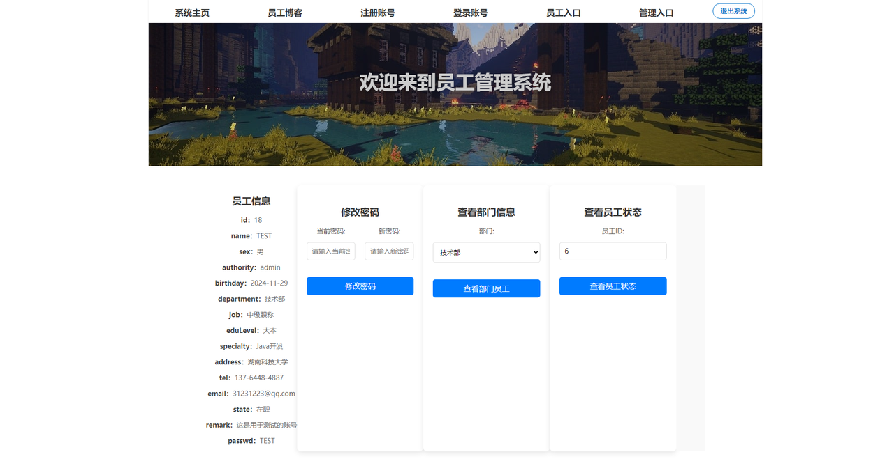
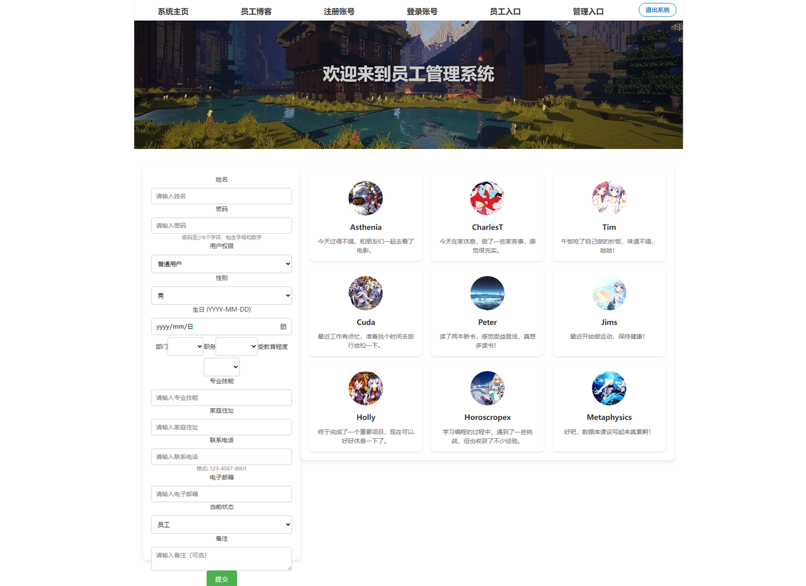
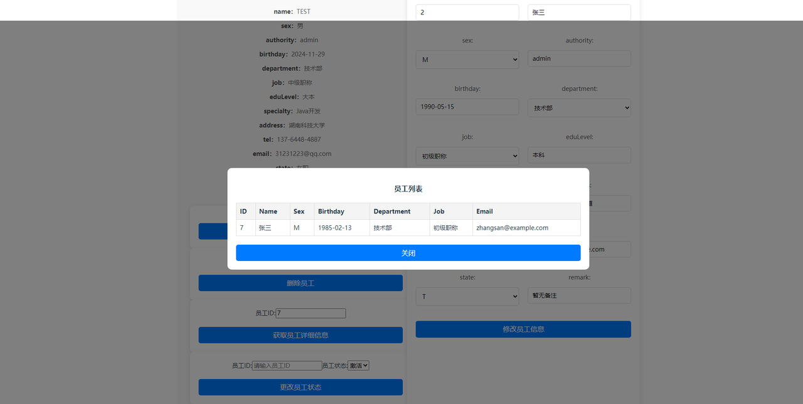
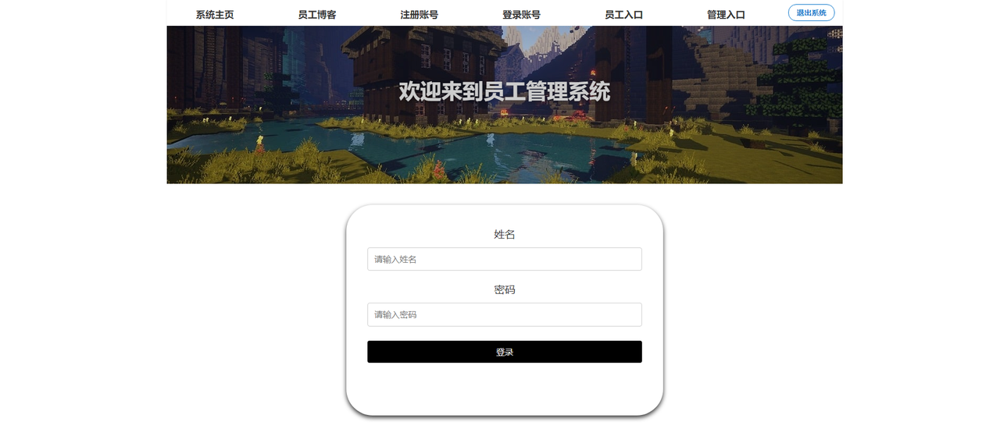
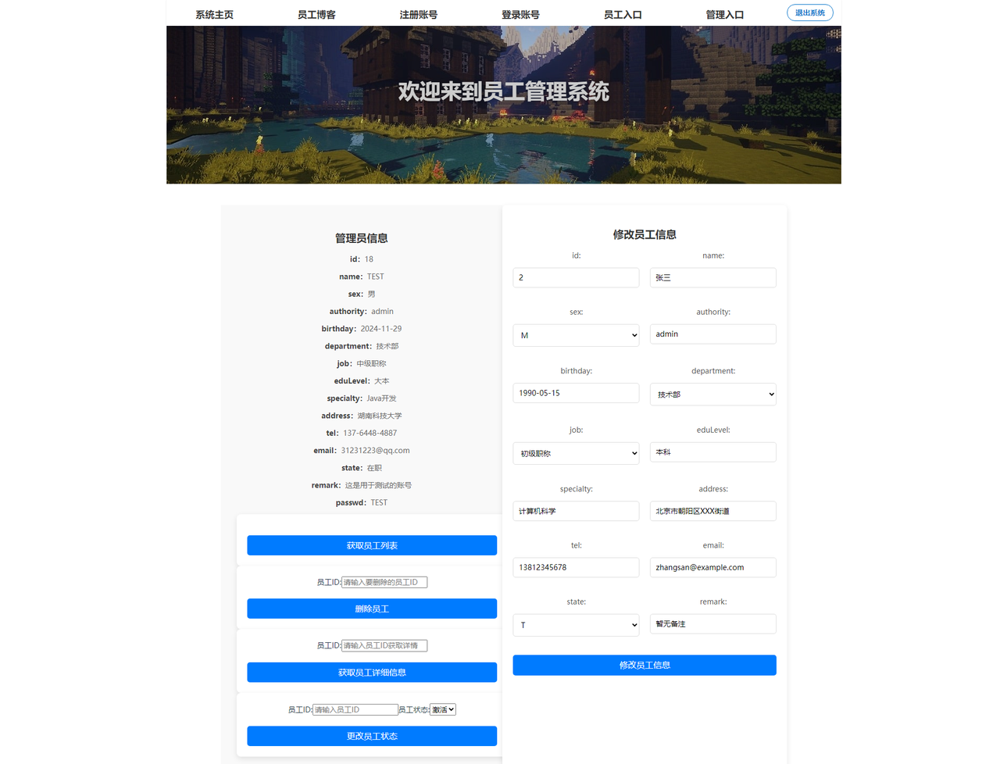
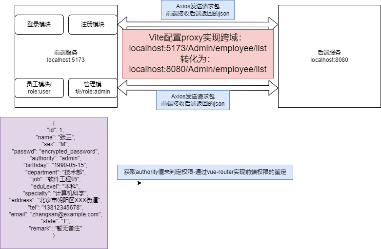
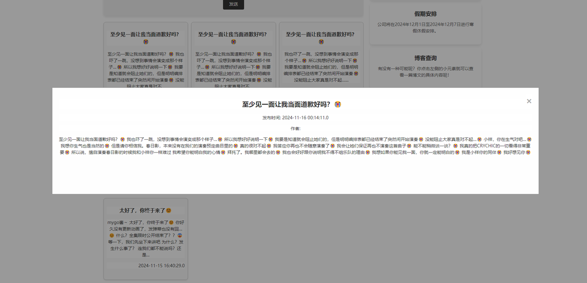
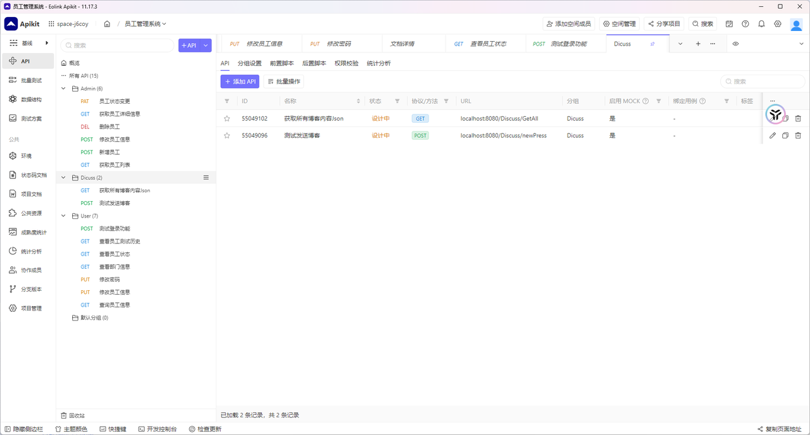
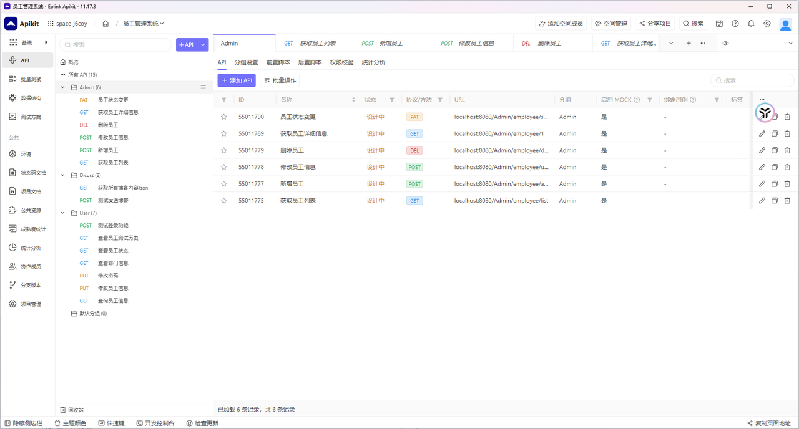

# 0.项目版本与功能迭代

| 版本号 | 内容                                                         |
| ------ | ------------------------------------------------------------ |
| V1.0   | 1.完成用户信息实体与关系 2.完成Blog功能                      |
| V1.1   | 1.新增经济系统 2.支持购买商品与商品存储 3.支持Redis在用户界面展示排行榜 |
|        |                                                              |


# 1.技术选型与环境变量

## 1.1技术选型

|             依赖名称              | 版本号      |
| :-------------------------------: | ----------- |
|                JDK                | JDK17.0.11  |
|            SpringBoot             | 3.0.2       |
|             SpringWeb             | starter稳定 |
|           Mybatis-Plus            | 3.5.5       |
|              Mybatis              | 3.0.3       |
|               druid               | 1.2.6       |
|             mysql5.7              |             |
|              Lombok               | starter稳定 |
|         Spring Data Redis         | starter稳定 |
|        Spring Data MongoDB        | starter稳定 |
|                JWT                | 0.12.3      |
|     Spring Security(已经完毕)     | starter稳定 |
| MongoDB 阿里云（用户自定义_都是） | 用户自定义_ |
|                                   |             |

## 1.2环境变量


|     变量名称      |     变量值     |
| :---------------: | :------------: |
| Application-port  |      8080      |
|   MySQL-DBName    | dataBaseDesign |
|  Mysql-username   |      root      |
|  Mysql-password   |   用户自定义   |
|  MongoDB-DBName   | dataBaseDesign |
|   security-name   |   用户自定义   |
| security-password |   用户自定义   |
|    Mysql-port     |      3306      |
|    Redis-port     |      6379      |
|   MongoDB-port    |     17017      |
|                   |                |
|                   |                |
|                   |                |


# 2.关系型数据库设计

## 2.0所有SQL汇总

> 所有的SQL已经汇总在schema.SQL文件,在根目录.
>
> 可以直接运行该文件获取项目SQL

## 2.1实体表（V1.0）

### 2.1.1:Object_Person

```sql
-- 如果数据库已经存在，先删除
DROP DATABASE IF EXISTS dataBaseDesign;

-- 创建新的数据库，指定字符集为 utf8mb4，并设置排序规则为 utf8mb4_general_ci
CREATE DATABASE dataBaseDesign
  CHARACTER SET utf8mb4
  COLLATE utf8mb4_general_ci;

```


| 字段名     | 数据类型                         | 是否可空 | 是否自增 | 说明                                 |
| ---------- | -------------------------------- | -------- | -------- | ------------------------------------ |
| ID         | INT                              | NOT NULL | TRUE     | 员工号（主键，唯一标识员工）         |
| PASSWD     | VARCHAR(255)                     | NOT NULL | FALSE    | 密码（存储加密密码）                 |
| AUTHORITY  | ENUM('admin', 'user', 'manager') | NOT NULL | FALSE    | 用户权限（如：管理员、用户、经理等） |
| NAME       | VARCHAR(100)                     | NOT NULL | FALSE    | 姓名                                 |
| SEX        | ENUM('M', 'F')                   | NOT NULL | FALSE    | 性别（M-男，F-女）                   |
| BIRTHDAY   | DATE                             | NOT NULL | FALSE    | 生日（格式：YYYY-MM-DD）             |
| DEPARTMENT | VARCHAR(100)                     | NOT NULL | FALSE    | 所在部门                             |
| JOB        | VARCHAR(100)                     | NOT NULL | FALSE    | 职务                                 |
| EDU_LEVEL  | VARCHAR(50)                      | NOT NULL | FALSE    | 受教育程度                           |
| SPCIALTY   | VARCHAR(100)                     | NOT NULL | FALSE    | 专业技能                             |
| ADDRESS    | VARCHAR(255)                     | NOT NULL | FALSE    | 家庭住址                             |
| TEL        | VARCHAR(15)                      | NOT NULL | FALSE    | 联系电话                             |
| EMAIL      | VARCHAR(100)                     | NOT NULL | FALSE    | 电子邮箱                             |
| STATE      | ENUM('T', 'F')                   | NOT NULL | FALSE    | 当前状态（T-员工，F-非员工）         |
| REMARK     | TEXT                             | NULL     | FALSE    | 备注                                 |

```sql
-- 创建员工表
CREATE TABLE Object_Person (
    ID INT NOT NULL AUTO_INCREMENT,           -- 员工号（主键，唯一标识员工）
    PASSWD VARCHAR(255) NOT NULL COMMENT '密码（存储加密密码）',             -- 密码（存储加密密码）
    AUTHORITY ENUM('admin', 'user', 'manager') NOT NULL COMMENT '用户权限（管理员、用户、经理等）', -- 用户权限（管理员、用户、经理等）
    NAME VARCHAR(100) NOT NULL COMMENT '姓名',               -- 姓名
    SEX ENUM('M', 'F') NOT NULL COMMENT '性别（M-男，F-女）',              -- 性别（M-男，F-女）
    BIRTHDAY DATE NOT NULL COMMENT '生日（格式：YYYY-MM-DD）',                   -- 生日（格式：YYYY-MM-DD）
    DEPARTMENT VARCHAR(100) NOT NULL COMMENT '所在部门',         -- 所在部门
    JOB VARCHAR(100) NOT NULL COMMENT '职务',                -- 职务
    EDU_LEVEL VARCHAR(50) NOT NULL COMMENT '受教育程度',           -- 受教育程度
    SPCIALTY VARCHAR(100) NOT NULL COMMENT '专业技能',           -- 专业技能
    ADDRESS VARCHAR(255) NOT NULL COMMENT '家庭住址',            -- 家庭住址
    TEL VARCHAR(15) NOT NULL COMMENT '联系电话',                 -- 联系电话
    EMAIL VARCHAR(100) NOT NULL COMMENT '电子邮箱',              -- 电子邮箱
    STATE ENUM('T', 'F') NOT NULL COMMENT '当前状态（T-员工，F-非员工）',            -- 当前状态（T-员工，F-非员工）
    REMARK TEXT COMMENT '备注（可空）',                              -- 备注（可空）
    PRIMARY KEY (ID) COMMENT '设置主键为员工号（ID）'                          -- 设置主键为员工号（ID）
) CHARACTER SET utf8mb4 COLLATE utf8mb4_general_ci;  -- 设置字符集和排序规则

```


### 2.1.2:Object_EduLevel

| 字段名      | 数据类型    | 是否可空 | 说明 |
| ----------- | ----------- | -------- | ---- |
| CODE        | INT         | NOT NULL | 代码 |
| DESCRIPTION | VARCHAR(50) | NOT NULL | 描述 |

```sql
-- 创建 Object_EduLevel 表
CREATE TABLE Object_EduLevel (
    NAME VARCHAR(30) NOT NULL COMMENT '学位',                 -- 学位（唯一标识教育级别）
    DESCRIPTION VARCHAR(50) NOT NULL COMMENT '描述',   -- 描述（教育级别的描述）
    PRIMARY KEY (CODE) COMMENT '设置主键为代码字段'  -- 设置主键为代码字段
) CHARACTER SET utf8mb4 COLLATE utf8mb4_general_ci;   -- 设置字符集和排序规则

```

```java
INSERT INTO Object_EduLevel (NAME, DESCRIPTION) VALUES
('小学', '基础教育阶段'),
('初中', '初级中学教育阶段'),
('高中', '高级中学教育阶段'),
('职高', '职业技术教育阶段'),
('大本', '本科高等教育'),
('大专', '专科学历教育'),
('硕士', '硕士研究生阶段'),
('博士', '博士研究生阶段'),
('博士后', '博士后科研阶段');

```


### 2.1.3:Object_Job

| 字段名      | 数据类型     | 是否可空 | 说明 |
| ----------- | ------------ | -------- | ---- |
| CODE        | VARCHAR(100) | not null | 代码 |
| DESCRIPTION |              | not null | 描述 |

```sql
-- 创建 Object_Job 表
CREATE TABLE Object_Job (
    NAME VARCHAR(50) NOT NULL COMMENT '职级',                 -- 职级（唯一标识职务）
    DESCRIPTION VARCHAR(50) NOT NULL COMMENT '描述',           -- 描述（职务的描述）
    PRIMARY KEY (NAME) COMMENT '设置主键为职级字段'          -- 设置主键为职级字段
) CHARACTER SET utf8mb4 COLLATE utf8mb4_general_ci;           -- 设置字符集和排序规则


```

```sql
-- 插入初级职称、中级职称、高级职称数据，带有随机描述
INSERT INTO Object_Job (NAME, DESCRIPTION) VALUES
('初级职称', '负责基础工作，执行日常任务，学习并掌握相关技能'),
('中级职称', '负责独立完成项目，能够指导初级职员，具备一定的管理能力'),
('高级职称', '负责战略规划和决策，管理团队，具有深厚的行业经验和领导力');


```


> | 0    | 小学   |
> | ---- | ------ |
> | 1    | 初中   |
> | 2    | 高中   |
> | 3    | 职高   |
> | 4    | 大本   |
> | 5    | 大专   |
> | 6    | 硕士   |
> | 7    | 博士   |
> | 8    | 博士后 |
>
> 这些数据是需要插入到Object_Job表的


### 2.1.4:Object_Department

| 字段名  | 数据类型     | 是否可空 | 是否自增 | 说明     |
| ------- | ------------ | -------- | -------- | -------- |
| ID      | INT          | not null | true     | 部门编号 |
| NAME    | VARCHAR(100) | not null | false    | 部门名称 |
| MANAGER | VARCHAR(100) | not null | false    | 部门经理 |
| INTRO   | TEXT         | not null | false    | 简介     |

```sql
CREATE TABLE Object_Department (
    ID INT NOT NULL AUTO_INCREMENT COMMENT '部门编号，设置为自增，作为每个部门的唯一标识符',  -- 部门编号，设置为自增
    NAME VARCHAR(100) NOT NULL COMMENT '部门名称，不能为空，用于标识部门的名称',              -- 部门名称
    MANAGER VARCHAR(100) NOT NULL COMMENT '部门经理，不能为空，记录该部门的负责人',            -- 部门经理
    INTRO TEXT NOT NULL COMMENT '部门简介，不能为空，用于简要描述部门的功能和职责',            -- 部门简介
    PRIMARY KEY (ID) COMMENT '设置 ID 字段为主键，确保每个部门的唯一性'                       -- 设置 ID 为主键
);

```


### 2.1.5:Object_PersonnelChange

| 字段名      | 数据类型     | 是否可空 | 说明 |
| ----------- | ------------ | -------- | ---- |
| CODE        | VARCHAR(50)  | not null | 代码 |
| DESCRIPTION | VARCHAR(255) | not null | 描述 |

```sql
CREATE TABLE Object_PersonnelChange (
    CODE VARCHAR(50) NOT NULL COMMENT '变更代码，不能为空，作为每种变更类型的唯一标识符',  -- 代码，不能为空
    DESCRIPTION VARCHAR(255) NOT NULL COMMENT '变更类型的描述，不能为空，用于简要说明变更的内容',  -- 描述，不能为空
    PRIMARY KEY (CODE) COMMENT '设置 CODE 字段为主键，保证变更代码的唯一性'  -- 设置 CODE 为主键
);

```

```java
INSERT INTO Object_PersonnelChange (CODE, DESCRIPTION)
VALUES 
    ('0', '新员工加入'),
    ('1', '职务变动'),
    ('2', '辞退');
```

### 2.1.6Blog

```sql
CREATE TABLE blog (
    id BIGINT AUTO_INCREMENT PRIMARY KEY,   -- 博客的唯一标识
    title VARCHAR(200) NOT NULL,             -- 博客标题，最大长度为200字符
    content TEXT NOT NULL,                   -- 博客内容
    author VARCHAR(100) NOT NULL,            -- 博客作者
    category VARCHAR(100),                   -- 博客分类（可选）
    is_published BOOLEAN DEFAULT FALSE,      -- 是否发布，默认为未发布
    creation_time TIMESTAMP DEFAULT CURRENT_TIMESTAMP -- 创建时间
);

```


## 2.2关系表(V1.0)

### 2.2.1:Relation_Personnel

| 字段名      | 数据类型    | 是否可空 | 是否自增 | 说明     |
| ----------- | ----------- | -------- | -------- | -------- |
| ID          | INT         | not null | true     | 记录编号 |
| PERSON      | VARCHAR(50) | not null | false    | 员工号   |
| Change_     | VARCHAR(50) | not null | false    | 变更代码 |
| DESCRIPTION | TEXT        | not null | false    | 详细记录 |

```sql
CREATE TABLE Relation_Personnel (
    ID INT NOT NULL AUTO_INCREMENT COMMENT '记录编号，设置为自增，作为每条记录的唯一标识符',   -- 记录编号，设置为自增
    PERSON VARCHAR(50) NOT NULL COMMENT '员工号，不能为空，用于标识该条记录所属的员工',         -- 员工号，不能为空
    Change_ VARCHAR(50) NOT NULL COMMENT '变更代码，不能为空，表示记录的变更类型',                 -- 变更代码，不能为空
    DESCRIPTION TEXT NOT NULL COMMENT '详细记录，不能为空，用于存储变更的具体描述信息',           -- 详细记录，不能为空
    PRIMARY KEY (ID) COMMENT '设置 ID 字段为主键，确保每条记录的唯一性'                   -- 设置 ID 为主
);

```

## 2.3实体表(V1.1)

####  **货币系统表** (`Currency`)

货币系统管理不同的货币种类和货币数量（例如员工的账户余额）。

```sql
CREATE TABLE Currency (
    ID INT NOT NULL AUTO_INCREMENT COMMENT '货币ID',
    PERSON_ID INT NOT NULL COMMENT '员工ID（外键，关联员工表）',
    CURRENCY_TYPE ENUM('gold', 'silver', 'credit') NOT NULL COMMENT '货币类型（如金币、银币、积分等）',
    BALANCE DECIMAL(10, 2) NOT NULL COMMENT '货币余额',
    LAST_UPDATE TIMESTAMP DEFAULT CURRENT_TIMESTAMP ON UPDATE CURRENT_TIMESTAMP COMMENT '最后更新时间',
    PRIMARY KEY (ID),
    FOREIGN KEY (PERSON_ID) REFERENCES Object_Person(ID) ON DELETE CASCADE
) CHARACTER SET utf8mb4 COLLATE utf8mb4_general_ci;
```

- `CURRENCY_TYPE` 字段指定了货币的类型（如金币、银币、积分等）。
- `BALANCE` 字段存储员工的货币余额。
- `PERSON_ID` 字段作为外键，关联员工表中的 `ID`，每个员工可以拥有多种类型的货币。

#### **商城商品表** (`Products`)

商城商品表存储商品的详细信息，包括图片、价格、逻辑删除标志和添加时间戳等。

```sql
CREATE TABLE Products (
    ID INT NOT NULL AUTO_INCREMENT COMMENT '商品ID',
    NAME VARCHAR(255) NOT NULL COMMENT '商品名称',
    DESCRIPTION TEXT COMMENT '商品描述',
    PRICE DECIMAL(10, 2) NOT NULL COMMENT '商品价格',
    IMAGE_URL VARCHAR(255) COMMENT '商品图片URL',
    IS_DELETED ENUM('T', 'F') NOT NULL DEFAULT 'F' COMMENT '是否删除（T-已删除，F-未删除）',
    CREATED_AT TIMESTAMP DEFAULT CURRENT_TIMESTAMP COMMENT '商品添加时间',
    UPDATED_AT TIMESTAMP DEFAULT CURRENT_TIMESTAMP ON UPDATE CURRENT_TIMESTAMP COMMENT '商品更新时间',
    PRIMARY KEY (ID)
) CHARACTER SET utf8mb4 COLLATE utf8mb4_general_ci;

```

- `IS_DELETED` 字段标识商品是否被删除（逻辑删除）。
- `PRICE` 字段是商品的价格。
- `IMAGE_URL` 字段存储商品的图片URL。
- `CREATED_AT` 和 `UPDATED_AT` 字段用于记录商品的创建和更新时间。

#### **用户背包表** (`User_Backpack`)

背包系统存储每个用户购买的商品（可以是商品ID和数量等）。

```sql
CREATE TABLE User_Backpack (
    ID INT NOT NULL AUTO_INCREMENT COMMENT '背包记录ID',
    PERSON_ID INT NOT NULL COMMENT '员工ID（外键，关联员工表）',
    PRODUCT_ID INT NOT NULL COMMENT '商品ID（外键，关联商品表）',
    QUANTITY INT NOT NULL COMMENT '商品数量',
    ADDED_AT TIMESTAMP DEFAULT CURRENT_TIMESTAMP COMMENT '商品添加到背包的时间',
    PRIMARY KEY (ID),
    FOREIGN KEY (PERSON_ID) REFERENCES Object_Person(ID) ON DELETE CASCADE,
    FOREIGN KEY (PRODUCT_ID) REFERENCES Products(ID) ON DELETE CASCADE
) CHARACTER SET utf8mb4 COLLATE utf8mb4_general_ci;

```

- `PERSON_ID` 字段作为外键，指向员工ID。
- `PRODUCT_ID` 字段作为外键，指向商品ID。
- `QUANTITY` 字段记录用户购买的商品数量。
- `ADDED_AT` 字段记录商品添加到背包的时间。

## 2.4关系表(V1.1)

#### **订单/交易记录表** (`Transactions`)

该表记录所有用户的购买记录，用于经济结算。

```SQL
CREATE TABLE Transactions (
    ID INT NOT NULL AUTO_INCREMENT COMMENT '交易记录ID',
    PERSON_ID INT NOT NULL COMMENT '员工ID（外键，关联员工表）',
    PRODUCT_ID INT NOT NULL COMMENT '商品ID（外键，关联商品表）',
    QUANTITY INT NOT NULL COMMENT '购买数量',
    TOTAL_PRICE DECIMAL(10, 2) NOT NULL COMMENT '总价格',
    TRANSACTION_DATE TIMESTAMP DEFAULT CURRENT_TIMESTAMP COMMENT '交易时间',
    PRIMARY KEY (ID),
    FOREIGN KEY (PERSON_ID) REFERENCES Object_Person(ID) ON DELETE CASCADE,
    FOREIGN KEY (PRODUCT_ID) REFERENCES Products(ID) ON DELETE CASCADE
) CHARACTER SET utf8mb4 COLLATE utf8mb4_general_ci;

```

- `TOTAL_PRICE` 字段记录这笔交易的总金额。
- `TRANSACTION_DATE` 字段记录交易的时间。

#### **经济结算表** (`Economy_Settlements`)

这个表用于记录每个员工的经济结算信息（例如每月的货币收入、支出、结余等）。

```SQL
CREATE TABLE Economy_Settlements (
    ID INT NOT NULL AUTO_INCREMENT COMMENT '结算记录ID',
    PERSON_ID INT NOT NULL COMMENT '员工ID（外键，关联员工表）',
    INCOME DECIMAL(10, 2) NOT NULL COMMENT '收入',
    EXPENSE DECIMAL(10, 2) NOT NULL COMMENT '支出',
    BALANCE DECIMAL(10, 2) NOT NULL COMMENT '当前结余',
    SETTLEMENT_DATE TIMESTAMP DEFAULT CURRENT_TIMESTAMP COMMENT '结算日期',
    PRIMARY KEY (ID),
    FOREIGN KEY (PERSON_ID) REFERENCES Object_Person(ID) ON DELETE CASCADE
) CHARACTER SET utf8mb4 COLLATE utf8mb4_general_ci;

```

- `INCOME` 和 `EXPENSE` 字段分别记录员工的收入和支出。
- `BALANCE` 字段记录每次结算后的结余。

# 3.MongoDB预留功能（该分支暂时废除）

## 3.1设计底稿

```java
1.技术：使用Vue生成Vue组件
2.CSS要求：
A.整体色调是黑白灰
B.功能组件使用卡片布局：鼠标移动到卡片上会有浮动效果
C.布局：整个页面左侧占比7/10 右侧占比 3/10
3.业务功能：
A.最终目的是实现一个在线论坛
B.最上方提供一个标题输入框+内容输入框+发送按钮->该部分点击后会将框内内容与本地localstroage中的name的value+发送时间以JSON的格式POST发送给后端的/Discuss/newPress接口
C.输入框下方可以加载N条帖子,帖子呈现卡片效果,且帖子展示部分内容+作者+发送时间
D.点击帖子卡片会弹出一个框,这个框会让除框之外的原界面呈现阴影覆盖效果，框右上角可以关闭这个框，框内最上方呈现帖子名,然后是发布时间和作者名，最下方是内容。
E.每一个帖子卡片的内容都是从后端获取若干JSON渲染的。这个接口是/Discuss/GetAll
```

## 3.2Blog的Request和Response设计

```java
import lombok.Data;
import javax.validation.constraints.NotEmpty;
import javax.validation.constraints.Size;
import java.util.List;

@Data
public class BlogRequest {

    @NotEmpty(message = "标题不能为空")
    @Size(max = 200, message = "标题长度不能超过200个字符")
    private String title; // 博客标题

    @NotEmpty(message = "博客内容不能为空")
    private String content; // 博客内容

    @NotEmpty(message = "作者不能为空")
    private String author; // 作者

    private String category; // 分类（可以选择）

    private List<String> tags; // 标签（多个标签）

    private boolean isPublished; // 是否发布


    // 其他可以扩展的字段，如发布时间等
}
/*title：博客的标题，不能为空，最大长度 200 字符。
content：博客的正文，不能为空。
author：博客作者，不能为空。
category：博客分类，可选。
tags：博客标签，可选，允许多个标签。
isPublished：是否发布博客，布尔值，默认为未发布。。**//

```

```java
import lombok.Data;

@Data
public class BlogResponse {

    private String id; // 博客的唯一标识（MongoDB的ID）

    private String title; // 博客标题

    private String contentPreview; // 内容预览（简短摘要）

    private boolean success; // 请求是否成功

    private String message; // 额外的消息说明，如错误信息

    // 如果是操作成功，可以返回创建时间等
    private String creationTime; // 博客创建时间

    // 构造方法，可以根据实际需要调整
    public BlogResponse(String id, String title, String contentPreview, boolean success, String message, String creationTime) {
        this.id = id;
        this.title = title;
        this.contentPreview = contentPreview;
        this.success = success;
        this.message = message;
        this.creationTime = creationTime;
    }
}

```

## 3.3MONGODB启动

```java
mkdir -p /var/java/mongodb/data /var/java/mongodb/log
```


```sh
bin/mongod --port=27017 --dbpath=/etc/mongodb/data --logpath=/etc/mongodb/log/mongodb.log --bind_ip=0.0.0.0 --fork
```

接着安装MongoShell-官网下载后部署在Linux即可

```java
tar -xf mongosh-2.3.3-linux-x64.tgz
```

## 3.4MONGODB启动失败错误排查

> ● mongod.service - MongoDB Database Server
> Loaded: loaded (/lib/systemd/system/mongod.service; disabled; vendor preset: enabled)
> Active: failed (Result: exit-code) since Fri 2024-11-15 04:52:00 PST; 10s ago
>   Docs: https://docs.mongodb.org/manual
> Process: 8980 ExecStart=/usr/bin/mongod --config /etc/mongod.conf (code=exited, status=14)
> Main PID: 8980 (code=exited, status=14)
>
> 你遇到的问题是 MongoDB 服务启动失败，状态码是 `status=14`。这个错误通常表示 MongoDB 配置文件中出现了问题，或者 MongoDB 本身在启动时遇到了其他环境或权限问题。
>
> 要解决这个问题，可以按照以下步骤进行排查和修复：
>
> ### 1. 查看 MongoDB 的日志
>
> 首先，查看 MongoDB 的日志文件，通常可以提供更详细的错误信息，帮助你找到问题的根本原因。
>
> ```bash
> sudo journalctl -u mongod.service
> ```
>
> 或者查看 MongoDB 的日志文件：
>
> ```bash
> cat /var/log/mongodb/mongod.log
> ```
>
> 根据日志信息，你可以发现更具体的错误原因。如果是权限问题、配置问题或者端口占用问题，日志中应该有所体现。
>
> ### 2. 检查 MongoDB 配置文件
>
> MongoDB 配置文件通常位于 `/etc/mongod.conf`。检查配置文件中的设置是否正确，特别是以下几个关键项：
>
> - **dbPath**: 确保 `dbPath` 指定的路径是有效的，并且 MongoDB 用户有权限写入这个目录。
>
>   ```yaml
>   storage:
>     dbPath: /var/lib/mongo
>   ```
>
>   如果这个路径不对或权限不足，会导致 MongoDB 启动失败。
>
> - **日志路径**: 确保日志路径设置正确且 MongoDB 有权限写入。
>
>   ```yaml
>   systemLog:
>     destination: file
>     path: /var/log/mongodb/mongod.log
>   ```
>
> - **端口设置**: 确保 MongoDB 使用的端口没有被其他进程占用。
>
> ### 3. 修复 dbPath 权限问题
>
> 如果是因为数据库路径（`dbPath`）权限问题导致启动失败，可以尝试修复该路径的权限。默认情况下，MongoDB 会使用 `/var/lib/mongo` 作为数据存储路径，确保 MongoDB 用户（通常是 `mongodb` 用户）对该路径具有足够的读写权限。
>
> ```bash
> sudo chown -R mongodb:mongodb /var/lib/mongo
> ```
>
> 然后确保日志目录 `/var/log/mongodb/` 也有正确的权限：
>
> ```bash
> sudo chown -R mongodb:mongodb /var/log/mongodb
> ```
>
> ### 4. 检查端口占用情况
>
> MongoDB 默认使用端口 27017。检查这个端口是否被其他进程占用：
>
> ```bash
> sudo lsof -i :27017
> ```
>
> 如果端口被占用，可能需要停止占用该端口的服务，或者修改 MongoDB 配置文件中的端口设置。
>
> ### 5. 启动 MongoDB 服务
>
> 修复了上述问题之后，可以尝试重新启动 MongoDB 服务：
>
> ```bash
> sudo systemctl start mongod
> ```
>
> 如果服务启动正常，可以使用以下命令检查服务状态：
>
> ```bash
> sudo systemctl status mongod
> ```
>
> ### 6. 启用服务自动启动
>
> 如果你希望 MongoDB 在系统启动时自动启动，可以启用它的自动启动功能：
>
> ```bash
> sudo systemctl enable mongod
> ```
>
> ### 7. 重新安装 MongoDB
>
> 如果以上步骤都没有解决问题，可以考虑重新安装 MongoDB 来排除安装过程中的问题。使用以下命令卸载并重新安装 MongoDB：
>
> ```bash
> sudo apt-get remove --purge mongodb-org*
> sudo apt-get install -y mongodb-org
> ```
>
> ### 结论
>
> 通常来说，错误 `status=14` 与配置文件错误、权限问题或端口冲突有关。通过查看日志和检查配置文件，可以找到具体原因并加以修复。希望这些步骤能帮助你解决 MongoDB 启动失败的问题。
> [Something went wrong, please try again later.]

# 4.Redis预留功能（V1.0）

# 5.接口设计

## 3.1模块设计

| 模块名         | URL    | 功能描述                           |
| -------------- | ------ | ---------------------------------- |
| 管理员端(V1.0) | /Admin | 操作员工的变动行为->查询通讯情况   |
| 员工端(V1.0)   | /User  | 员工登录->查看自己的状况->站内通讯 |

## 3.2模块接口设计

### 3.2.1管理员端(/Admin)(V1.0)

| 功能名                        | 接口类型 | 接口路径               | 入参类型             | 返回值类型          | 功能分析                     | 备注                  |
| ----------------------------- | -------- | ---------------------- | -------------------- | ------------------- | ---------------------------- | --------------------- |
| 获取员工列表                  | GET      | /Admin/employee/list   | 无                   | JSON（员工数据）    | 查询并返回所有员工的详细信息 | 包含分页、排序功能    |
| 新增员工(X)这个可以用注册来做 | POST     | /Admin/employee/add    | JSON（员工信息）     | 成功/失败（状态码） | 添加新的员工信息到数据库     | 必须提供所有字段      |
| 修改员工信息                  | POST     | /Admin/employee/update | JSON（员工信息）     | 成功/失败（状态码） | 更新现有员工的个人信息       | 必须提供员工ID        |
| 删除员工                      | DELETE   | /Admin/employee/delete | JSON（员工ID）       | 成功/失败（状态码） | 删除员工记录                 | 需要提供员工ID        |
| 获取员工详细信息              | GET      | /Admin/employee/{id}   | 员工ID（路径参数）   | JSON（员工信息）    | 查询某一员工的详细信息       | 根据ID查询            |
| 员工状态变更                  | PATCH    | /Admin/employee/status | JSON（员工ID, 状态） | 成功/失败（状态码） | 更改员工的当前状态（T/F）    | 状态只能是 'T' 或 'F' |

### 3.2.2员工端（/User）(V1.0)

| 功能名           | 接口类型 | 接口路径                     | 入参类型                  | 返回值类型     | 功能分析                                                     | 备注                   |
| ---------------- | -------- | ---------------------------- | ------------------------- | -------------- | ------------------------------------------------------------ | ---------------------- |
| **查询员工信息** | GET      | /User/employee/{ID}          | ID: INT                   | Employee对象   | 根据员工ID获取员工的基本信息（如姓名、性别、部门等），用于员工自助查看个人信息。 | 无需修改信息           |
| **修改员工信息** | PUT      | /User/employee/{ID}          | Employee对象              | success/fail   | 更新员工信息（如联系方式、住址等）。只允许修改自己的信息，需验证权限。 | 不允许修改敏感信息     |
| **修改密码**     | PUT      | /User/employee/{ID}/password | newPassword: STRING       | success/fail   | 修改员工的登录密码。员工需提供旧密码和新密码，成功后返回修改结果。 | 密码需加密存储         |
| **查看部门信息** | GET      | /User/employee/department    | department: STRING        | List<Employee> | 获取指定部门下的所有员工信息，按部门查看同事情况。           | 部门数据需要权限控制   |
| **查看员工状态** | GET      | /User/employee/status/{ID}   | ID: INT                   | ENUM('T', 'F') | 查询员工当前的在职状态（'T'表示在职，'F'表示离职）。         | 员工只能查看自己的状态 |
| **查看员工历史** | GET      | /User/employee/{ID}/history  | ID: INT                   | List<History>  | 查询员工的历史记录，包括职位变动、部门变动等历史信息。       | 仅员工自己可查看       |
| 用户登录         | POST     | /User/employee/Login         | NAME:String PASSWD:STRING | List<Employee> | 用于实现用户登录功能                                         | 员工自身行为           |

# 6.POJO设计

## 6.1返回给前端的Result(V1.0)

```java
import lombok.AllArgsConstructor;
import lombok.Data;
import lombok.NoArgsConstructor;

@Data
@NoArgsConstructor
@AllArgsConstructor
public class Result<T> {
    private boolean success;
    private String message;
    private T data;
}

```

前端拿到的结果：

```json
{
  "success": true,
  "message": "操作成功",
  "data": {
    "id": 12345,
    "name": "张三"
    // ... 其他Employee属性
  }
}

```

```json
{
  "success": false,
  "message": "操作失败"
}

```

## 6.2Entity-与数据库交互

## 6.3DTO-服务与前端交互

# 7.基于Eolink的API测试

## 7.1Json格式规范化-基于Object_Person

```json
{
  "id": 1,
  "name": "张三",
  "sex": "M",
  "authority": "admin",
  "birthday": "1990-05-15",
  "department": "技术部",
  "job": "软件工程师",
  "eduLevel": "本科",
  "specialty": "计算机科学",
  "address": "北京市朝阳区XXX街道",
  "tel": "13812345678",
  "email": "zhangsan@example.com",
  "state": "T",
  "remark": "暂无备注"
}

```

上述的格式一定是最优服从Object_Person的sql表结构需求,其次关注Entity需求,最后关注DTO需求

值得注意的是：对于  "birthday": "1990-05-15",这种特殊结构的数据,需要在Entity和DTO上用`@JsonFormat(pattern = "yyyy-MM-dd")`修饰

# 8.测试服务

```java
1.部门有：技术部/后勤部/行政部
2.教育有：初中	初级中学教育阶段
博士	博士研究生阶段
博士后	博士后科研阶段
大专	专科学历教育
大本	本科高等教育
小学	基础教育阶段
硕士	硕士研究生阶段
职高	职业技术教育阶段
高中	高级中学教育阶段
3.职称有中级职称	负责独立完成项目，能够指导初级职员，具备一定的管理能力
初级职称	负责基础工作，执行日常任务，学习并掌握相关技能
高级职称	负责战略规划和决策，管理团队，具有深厚的行业经验和领导力
4.AUTHORITY有'admin','user','manager'
5.根据上述标准 就-- 创建员工表
CREATE TABLE Object_Person (
    ID INT NOT NULL AUTO_INCREMENT,           -- 员工号（主键，唯一标识员工）
    PASSWD VARCHAR(255) NOT NULL COMMENT '密码（存储加密密码）',             -- 密码（存储加密密码）
    AUTHORITY ENUM('admin', 'user', 'manager') NOT NULL COMMENT '用户权限（管理员、用户、经理等）', -- 用户权限（管理员、用户、经理等）
    NAME VARCHAR(100) NOT NULL COMMENT '姓名',               -- 姓名
    SEX ENUM('M', 'F') NOT NULL COMMENT '性别（M-男，F-女）',              -- 性别（M-男，F-女）
    BIRTHDAY DATE NOT NULL COMMENT '生日（格式：YYYY-MM-DD）',                   -- 生日（格式：YYYY-MM-DD）
    DEPARTMENT VARCHAR(100) NOT NULL COMMENT '所在部门',         -- 所在部门
    JOB VARCHAR(100) NOT NULL COMMENT '职务',                -- 职务
    EDU_LEVEL VARCHAR(50) NOT NULL COMMENT '受教育程度',           -- 受教育程度
    SPCIALTY VARCHAR(100) NOT NULL COMMENT '专业技能',           -- 专业技能
    ADDRESS VARCHAR(255) NOT NULL COMMENT '家庭住址',            -- 家庭住址
    TEL VARCHAR(15) NOT NULL COMMENT '联系电话',                 -- 联系电话
    EMAIL VARCHAR(100) NOT NULL COMMENT '电子邮箱',              -- 电子邮箱
    STATE ENUM('T', 'F') NOT NULL COMMENT '当前状态（T-员工，F-非员工）',            -- 当前状态（T-员工，F-非员工）
    REMARK TEXT COMMENT '备注（可空）',                              -- 备注（可空）
    PRIMARY KEY (ID) COMMENT '设置主键为员工号（ID）'                          -- 设置主键为员工号（ID）
) CHARACTER SET utf8mb4 COLLATE utf8mb4_general_ci;  -- 设置字符集和排序规则
表
7.生成10条插入信息语句
```

# 1.技术选型与环境变量

## 1.1技术选型

|      依赖名称      | 版本号 |
| :----------------: | :----: |
|        vue         | 3.5.12 |
|     vue-router     | 4.0.13 |
| @vitejs/plugin-vue | 5.1.4  |
|        vite        | 5.4.10 |
|    arco-design     |        |
|       axios        |        |
|                    |        |
|                    |        |
|                    |        |

## 1.2.前后端的跨域问题

在vite.config.js中

```js
import { defineConfig } from 'vite';
import vue from '@vitejs/plugin-vue'; // 导入 Vue 插件

// https://vite.dev/config/
export default defineConfig({
  plugins: [vue()], // 在 plugins 数组中添加 vue 插件
  server: {
    proxy: {
      // 配置代理，将前端请求的接口路径代理到后端的 localhost:8080 上
      '/Admin': {
        target: 'http://localhost:8080/Admin', // 后端服务的地址
        changeOrigin: true, // 是否改变请求头中的Origin字段
        rewrite: (path) => path.replace(/^\/Admin/, ''), // 重写路径，去掉前缀
      },
      '/User': {
        target: 'http://localhost:8080/User', // 后端服务的地址
        changeOrigin: true, // 是否改变请求头中的Origin字段
        rewrite: (path) => path.replace(/^\/User/, ''), // 重写路径，去掉前缀
      }
    }
  }
});

```

因为我们的前端是localhost:5173；但是后端是localhost:8080

当我们在前端通过axios进行发包的时候,前面的`IP+端口`和后端的`IP+端口`是不一致的

因此我们需要配置proxy,让前端的`localhost:5173/Admin`等价于后端的`localhost:8080/Admin`

其次关于rewrite:

> ### 举个例子
>
> 假设你的前端请求路径是 `/Admin/api/login`，并且你配置了以下代理：
>
> ```
> jsCopy Code'/Admin': {
> target: 'http://localhost:8080/Admin',
> rewrite: (path) => path.replace(/^\/Admin/, '')
> }
> ```
>
> 1. 前端发送请求：
>    - 请求：`/Admin/api/login`
> 2. 代理生效后：
>    - 请求路径通过 `rewrite` 被重写为：`/api/login`
> 3. 请求被转发到目标服务器：
>    - 请求被转发到 `http://localhost:8080/api/login`。
>
> 通过这种方式，前端可以使用 `/Admin` 或 `/User` 前缀来区分不同的功能模块，而后端可以按照统一的 API 结构处理这些请求，避免了前端和后端之间路径不一致的问题。

我们这里用rewrite,然后再target中加上这个rewrite去掉的状态，其实结果是不变的。

我们是为了展示rewrite的功能才这样写的

> ### `changeOrigin` 的作用
>
> - **`changeOrigin: true`**：请求的 `Origin` 字段会被修改为目标服务器的地址（即 `target` 的域名）。
> - **`changeOrigin: false`（默认值）**：请求的 `Origin` 字段保持不变，即保持原始请求的来源。
>
> ### 为什么要使用 `changeOrigin`？
>
> 在开发过程中，尤其是进行跨域请求时，浏览器会验证请求的 `Origin` 字段，确保它与目标服务器的跨域策略一致。比如，当你从 `http://localhost:3000` 向 `http://api.example.com` 发送请求时，目标服务器可能会检查请求头中的 `Origin` 字段，看它是否匹配服务器允许的来源。如果不匹配，服务器可能会拒绝这个请求。
>
> 当你使用代理时，`changeOrigin: true` 会把请求的 `Origin` 改成代理目标的地址，从而绕过这种跨域问题，模拟直接从目标服务器发起的请求，避免服务器因为跨域问题拒绝请求。
>
> ### 示例
>
> 假设你正在开发一个前端应用，运行在 `http://localhost:3000`，并且想要通过代理请求后端服务器，后端服务器的 URL 是 `http://api.example.com`。
>
> #### 不使用 `changeOrigin`
>
> 在这种情况下，前端请求头中的 `Origin` 会是 `http://localhost:3000`，后端服务器收到请求时会看到这个 `Origin` 字段。如果后端没有允许 `localhost:3000` 作为合法来源，浏览器会阻止请求。
>
> #### 使用 `changeOrigin: true`
>
> 如果你在代理配置中启用了 `changeOrigin: true`，代理服务器会将请求的 `Origin` 修改为目标服务器的地址 `http://api.example.com`，这就模拟了请求是直接从 `http://api.example.com` 发出的，后端服务器会接受这个请求，避免了跨域问题。

# 2.权限设计

# 3.路由设计

## 3.1路由分类设计

## 3.2路由守卫+axios接收后端值+权限判断

- 业务流程：

  - 登录界面发送登录请求
  - 登录成功后，后端发送登录用户的全部数据作为一个json
  - 我们拆分json中的字段->找到"authority"字段,用来表明登录成功后的身份
  - 将authority字段中的值去掉括号->例如本来是"admin",要处理成admin
  - 设置localstorage中的isLoggedIn字段为true,表明已经登录成功
  - 在vue-router中的router.beforeEach中进行路由权限判断

- 代码实现

- ```js
  router.beforeEach((to, from, next) => {
      const isAuthenticated = localStorage.getItem('isLoggedIn') === 'true';
      const userAuthority = localStorage.getItem('authority');
  
      if (to.meta.requiresAuth && !isAuthenticated) {
          console.log("用户未登录，重新跳转登录页面");
          next('/Login');
      } else if (to.meta.role) {
          // 检查用户角色是否满足路由权限要求
          if (userAuthority) {
              // 如果存在角色值，判断角色是否匹配
              if (userAuthority === to.meta.role) {
                  next();  // 用户角色符合要求，放行
              } else {
                  console.log("用户权限不足，重新跳转首页页面");
                  next('/');  // 用户权限不足，跳转到首页
              }
          } else {
              console.log("用户角色未设置，跳转到登录页面");
              next('/Login');  // 如果没有角色，跳转到登录页
          }
      } else {
          next(); // 不需要权限的页面，直接放行
      }
  });
  ```

- 路由的权限规定：

  - ```js
    {
           path: '/AdminOperation',
           component: () => import('/src/pages/Operation/AdminOperation.vue'),  // 管理操作页
           meta: { requiresAuth: true, role: 'admin' }  // 只有管理员可以访问
       },
       {
           path: '/PersonOperation',
           component: () => import('/src/pages/Operation/PersonOperation.vue'),  // 员工操作页
           meta: { requiresAuth: true, role: 'user' }  // 只有员工可以访问
       },
       {
           path: '/SelfInformation',
           component: () => import('/src/pages/Self/SelfInformation.vue'),  // 个人信息页
           meta: { requiresAuth: true }  // 需要认证的页面
       }
    ```

  - 路由的权限：是通过meta设置的。首先是`requiresAuth:true`接着就是`role:'user'` 特别注意：这里的单引号user对应的是localstroage中的无引号的user.这一点我排查了很久才解决

    

# 4.界面设计

## 4.1公用组件

| 组件名     | 组件路由（公用无路由） | 组件地址                                 | 组件功能               |
| ---------- | ---------------------- | ---------------------------------------- | ---------------------- |
| 左侧导航栏 | '/Navigation'          | '/src/components/Column/Navigation.vue'  | 实现多级栏目的跳转     |
| 上方信息栏 | '/Information'         | '/src/components/Column/Information.vue' | 查看用户信息           |
| 右侧悬浮框 | '/Flex'                | '/src/components/Tips/Flex.vue'          | 提供公告信息和宣传信息 |
|            |                        |                                          |                        |
|            |                        |                                          |                        |
|            |                        |                                          |                        |
|            |                        |                                          |                        |
|            |                        |                                          |                        |
|            |                        |                                          |                        |

## 4.2页面组件

| 欢迎页     | '/Main'            | '/src/pages/MainPage/Main.vue'             | 实现用户的欢迎     |
| ---------- | ------------------ | ------------------------------------------ | ------------------ |
| 组件名     | 组件路由           | 组件地址                                   | 组件功能           |
| 注册页     | '/Register'        | '/src/pages/LoginAndRegister/Register.vue' | 实现用户的注册     |
| 登录页     | '/Login'           | '/src/pages/LoginAndRegister/Login.vue'    | 实现用户的登录     |
| 管理操作页 | '/AdminOperation'  | '/src/pages/Operation/AdminOperation.vue'  | 管理员的操作页面   |
| 员工操作页 | '/PersonOperation' | '/src/pages/Operation/PersonOperation.vue' | 员工的操作页面     |
| 个人信息页 | '/SelfInformation' | '/src/pages/Self/SelfInformation.vue'      | 个人信息的查看页面 |
|            |                    |                                            |                    |
|            |                    |                                            |                    |
|            |                    |                                            |                    |
|            |                    |                                            |                    |

```java
app.component('Information',Information)
app.component('Navigation',Navigation)
app.component('Flex',Flex)
```

# 5.BUG分析

## 5.1：后端传回authority,前端的路由守卫无法获取这个值,导致权限校验失败

解决策略：

后端传回的值

```json
{
    "id": 2,
    "passwd": "123123",
    "authority": "user",
    "name": "测试者",
    "sex": "M",
    "birthday": "2024-11-10",
    "department": "技术部",
    "job": "技术员",
    "eduLevel": "大专",
    "specialty": "计算机",
    "address": "湖科大",
    "tel": "137-6206-4648",
    "email": "3123123@qq.com",
    "state": "T",
    "remark": "测试信息"
}
```

- 每一个值都是双引号包裹的
- 默认是将整个对象存到localstorage里面的

我们的需求：

1. localstroage存在键值对[authority]-[admin]
2. 去掉引号

```js
        Object.keys(response.data).forEach(key => {
          // 将对象转换为字符串，并将双引号替换为单引号
          const dataWithSingleQuotes = JSON.stringify(response.data[key])
              .replace(/"/g, "'");

          // 将替换后的数据存储到 localStorage
          localStorage.setItem(key, dataWithSingleQuotes);
        });

// 设置登录标志
        localStorage.setItem('isLoggedIn', 'true');

// 如果有其他需要存储的内容，例如 authority
        const authorityWithSingleQuotes = JSON.stringify(response.data.authority)
            .replace(/"/g, "");

        localStorage.setItem('authority', authorityWithSingleQuotes);
```


上述是处理之后的结果。

但是默认情况拿到的是"admin"

因此在vue-router的校验中就会出问题

## 5.2路由守卫配置不当导致无限循环->Main页面无法被加载

> 你遇到的这个问题，是由于在 Vue 路由守卫中出现了 **无限重定向** 的情况。具体来说，`/Register` 页面会被重定向到 `/Main` 页面，然后 `/Main` 页面又根据你的守卫逻辑进行再次重定向，导致了无限循环。
>
> ### 问题分析
>
> 在你的 `beforeEach` 导航守卫中，当用户没有登录时，目标是跳转到 `/Main`（假设 `/Main` 页面是公共页面或者首页）。而根据你代码的逻辑，`/Main` 页面可能也被认为是需要身份验证的页面，这会导致 `beforeEach` 守卫再次触发，并重定向回 `/Main`，从而导致无限循环。
>
> ### 具体问题
>
> ```js
> if (to.meta.requiresAuth && !isAuthenticated) {
>  console.log("用户未登录，重新跳转登录页面");
>  next('/Main'); // 如果没有登录，跳转到首页（/Main）
> }
> ```
>
> 如果你在 `/Main` 页面上设置了 `meta.requiresAuth = true`，那么当用户未登录时，就会被重定向到 `/Main` 页面，但由于 `/Main` 需要身份验证，这将导致再次触发 `beforeEach` 守卫，进而再次重定向到 `/Main`，形成一个无限循环。
>
> ### 解决方案
>
> 要解决这个问题，你需要添加一些逻辑来避免这种重定向循环。通常可以通过以下几个方法来处理：
>
> #### 1. **避免对目标页面的重定向**
>
> 在进行重定向之前，你需要确保目标页面不是当前页面，避免发生重复的重定向。
>
> ```js
> router.beforeEach((to, from, next) => {
>  const isAuthenticated = localStorage.getItem('isLoggedIn') === 'true';
>  const userAuthority = localStorage.getItem('authority');
> 
>  // 检查是否已经在目标页面，避免重复跳转
>  if (to.path === from.path) {
>      return next();  // 如果目标路径和当前路径相同，则直接放行
>  }
> 
>  if (to.meta.requiresAuth && !isAuthenticated) {
>      console.log("用户未登录，重新跳转登录页面");
>      next('/Main');  // 用户未登录，跳转到首页
>  } else if (to.meta.role) {
>      // 检查用户角色是否满足路由权限要求
>      if (userAuthority) {
>          if (userAuthority === to.meta.role) {
>              next();  // 用户角色符合要求，放行
>          } else {
>              console.log("用户权限不足，重新跳转首页页面");
>              alert("用户权限不足，请您先登录");
>              next('/Main');  // 用户权限不足，跳转到首页
>          }
>      } else {
>          console.log("用户角色未设置，跳转到登录页面");
>          next('/Login');  // 如果没有角色，跳转到登录页
>      }
>  } else {
>      next(); // 不需要权限的页面，直接放行
>  }
> });
> ```
>
> #### 2. **防止多次重定向到相同页面**
>
> 如果用户已经在 `/Main` 页面，不应该再跳转到 `/Main`，即避免 `next('/Main')` 被执行多次。
>
> 你可以在代码中添加类似的逻辑，在重定向之前检查当前的路由路径：
>
> ```js
> if (to.path === '/Register' && isAuthenticated) {
>  // 如果用户已经登录了，避免重定向到 /Register
>  return next('/Main');
> } else if (to.path === '/Main' && !isAuthenticated) {
>  // 如果用户未登录，避免重定向到 /Main
>  return next('/Register');
> }
> ```
>
> #### 3. **解决登录后的重定向问题**
>
> 在你的代码中，如果用户已经登录（`isAuthenticated` 为 `true`），但仍然在尝试访问一个需要身份验证的页面时，应该直接放行。如果用户已经登录了，且访问的是 `/Register` 页面（一般注册页面应该是未登录状态下才访问的），可以直接重定向到 `/Main`，避免无意义的跳转。
>
> ```js
> if (to.path === '/Register' && isAuthenticated) {
>  return next('/Main');  // 如果已登录，直接跳转到首页（/Main）
> }
> ```
>
> #### 4. **使用 `next(false)` 退出当前导航**
>
> 如果你在路由守卫中检测到某些情况（例如用户已经在正确的页面），可以使用 `next(false)` 来停止当前的导航，防止重定向发生。
>
> ```js
> router.beforeEach((to, from, next) => {
>  const isAuthenticated = localStorage.getItem('isLoggedIn') === 'true';
>  const userAuthority = localStorage.getItem('authority');
> 
>  if (to.path === '/Main' && !isAuthenticated) {
>      // 未登录时跳转到 /Main，不需要再次跳转
>      return next('/Login');
>  }
> 
>  if (to.meta.requiresAuth && !isAuthenticated) {
>      console.log("用户未登录，重新跳转登录页面");
>      next('/Main');  // 如果没有登录，跳转到首页（/Main）
>  } else if (to.meta.role) {
>      // 检查用户角色是否满足路由权限要求
>      if (userAuthority) {
>          if (userAuthority === to.meta.role) {
>              next();  // 用户角色符合要求，放行
>          } else {
>              console.log("用户权限不足，重新跳转首页页面");
>              alert("用户权限不足，请您先登录");
>              next('/Main');  // 用户权限不足，跳转到首页
>          }
>      } else {
>          console.log("用户角色未设置，跳转到登录页面");
>          next('/Login');  // 如果没有角色，跳转到登录页
>      }
>  } else {
>      next(); // 不需要权限的页面，直接放行
>  }
> });
> ```
>
> ### 总结
>
> 通过上述修改，主要是避免重复的重定向，并且确保在已经到达目标页面时，不会再进行重定向，避免了无限循环的问题。你还需要确保登录状态和权限校验的逻辑不会造成重复的重定向。

## 5.3.路由无异常,组件已注册.跳转到组件页面为何不加载<template>但是Js却能工作？

是因为我们的跳转+展示是依赖于<router-view></router-view>的。

而<router-view></router-view>需要你在本组件中对需要跳转的页面使用<router-link>

而我先前是：仅仅在main.js中注册了组件,在router.js中注册了路由，缺少了在App组件中对该组件的<router-link>

从而导致了失败