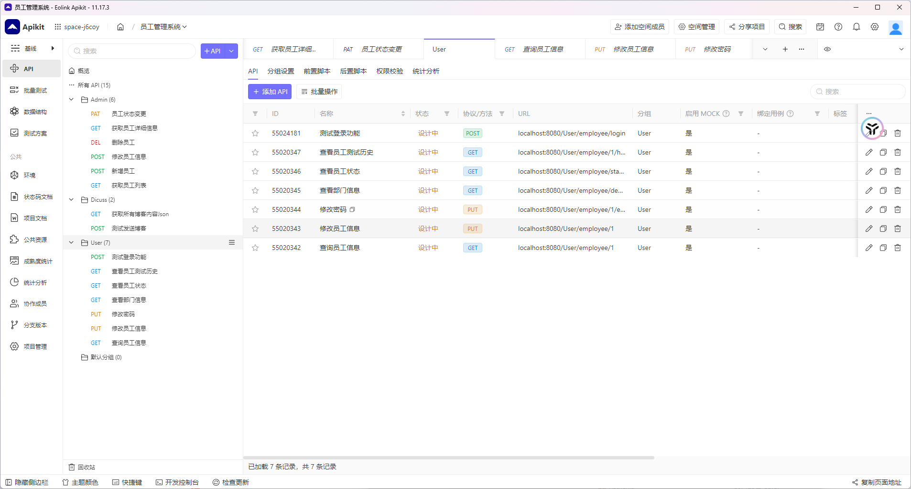

# 0.项目版本与功能迭代&&项目结构图

## 0.1项目版本号

| 版本号         | 内容                                                         |
| -------------- | ------------------------------------------------------------ |
| V1.0           | 1.完成用户信息实体与关系 2.完成Blog功能                      |
| V1.1(未来版本) | 1.新增经济系统 2.支持购买商品与商品存储 3.支持Redis在用户界面展示排行榜 |
|                |                                                              |

## 0.2后端结构图

```java
├─src
│  ├─main
│  │  ├─java
│  │  │  └─com
│  │  │      └─xiaoyongcai
│  │  │          └─io
│  │  │              └─databasedesign
│  │  │                  ├─Controller
│  │  │                  ├─demos
│  │  │                  │  └─web
│  │  │                  ├─Mapper
│  │  │                  ├─Pojo
│  │  │                  │  ├─DTO
│  │  │                  │  ├─Entity
│  │  │                  │  └─ResquestAndResponse
│  │  │                  ├─Service
│  │  │                  │  └─Impl
│  │  │                  └─Tools
│  │  └─resources
│  │      └─static
│  └─test
│      └─java
│          └─com
│              └─xiaoyongcai
│                  └─io
│                      └─databasedesign
└─target
    ├─classes
    │  ├─com
    │  │  └─xiaoyongcai
    │  │      └─io
    │  │          └─databasedesign
    │  │              ├─Controller
    │  │              ├─demos
    │  │              │  └─web
    │  │              ├─Mapper
    │  │              ├─Pojo
    │  │              │  ├─DTO
    │  │              │  └─Entity
    │  │              └─Service
    │  │                  └─Impl
    │  └─static
    ├─generated-sources
    │  └─annotations
    ├─maven-archiver
    └─maven-status
        └─maven-compiler-plugin
            └─compile
                └─default-compile

```


# 1.技术选型与环境变量

## 1.1技术选型

|              依赖名称              | 版本号       |
| :--------------------------------: | ------------ |
|                JDK                 | JDK17.0.11   |
|             SpringBoot             | 3.0.2        |
|             SpringWeb              | starter稳定  |
|            Mybatis-Plus            | 3.5.5        |
|              Mybatis               | 3.0.3        |
|               druid                | 1.2.6        |
|              mysql5.7              |              |
|               Lombok               | starter稳定  |
|         Spring Data Redis          | starter稳定  |
|        Spring Data MongoDB         | starter稳定  |
|                JWT                 | 0.12.3       |
|     Spring Security(已经完毕)      | starter稳定  |
| MongoDB 阿里云（Xiaoyongcai_都是） | Xiaoyongcai_ |
|                                    |              |

## 1.2环境变量


|     变量名称      |     变量值     |
| :---------------: | :------------: |
| Application-port  |      8080      |
|   MySQL-DBName    | dataBaseDesign |
|  Mysql-username   |      root      |
|  Mysql-password   |  xiaoyongcai   |
|  MongoDB-DBName   | dataBaseDesign |
|   security-name   |  xiaoyongcai   |
| security-password |  xiaoyongcai   |
|    Mysql-port     |      3306      |
|    Redis-port     |      6379      |
|   MongoDB-port    |     17017      |
|                   |                |
|                   |                |
|                   |                |


# 2.关系型数据库设计

## 2.0所有SQL汇总

> 所有的SQL已经汇总在schema.SQL文件,在根目录.
>
> 可以直接运行该文件获取项目SQL

## 2.1实体表（V1.0）

### 2.1.1:Object_Person

```sql
-- 如果数据库已经存在，先删除
DROP DATABASE IF EXISTS dataBaseDesign;

-- 创建新的数据库，指定字符集为 utf8mb4，并设置排序规则为 utf8mb4_general_ci
CREATE DATABASE dataBaseDesign
  CHARACTER SET utf8mb4
  COLLATE utf8mb4_general_ci;

```


| 字段名     | 数据类型                         | 是否可空 | 是否自增 | 说明                                 |
| ---------- | -------------------------------- | -------- | -------- | ------------------------------------ |
| ID         | INT                              | NOT NULL | TRUE     | 员工号（主键，唯一标识员工）         |
| PASSWD     | VARCHAR(255)                     | NOT NULL | FALSE    | 密码（存储加密密码）                 |
| AUTHORITY  | ENUM('admin', 'user', 'manager') | NOT NULL | FALSE    | 用户权限（如：管理员、用户、经理等） |
| NAME       | VARCHAR(100)                     | NOT NULL | FALSE    | 姓名                                 |
| SEX        | ENUM('M', 'F')                   | NOT NULL | FALSE    | 性别（M-男，F-女）                   |
| BIRTHDAY   | DATE                             | NOT NULL | FALSE    | 生日（格式：YYYY-MM-DD）             |
| DEPARTMENT | VARCHAR(100)                     | NOT NULL | FALSE    | 所在部门                             |
| JOB        | VARCHAR(100)                     | NOT NULL | FALSE    | 职务                                 |
| EDU_LEVEL  | VARCHAR(50)                      | NOT NULL | FALSE    | 受教育程度                           |
| SPCIALTY   | VARCHAR(100)                     | NOT NULL | FALSE    | 专业技能                             |
| ADDRESS    | VARCHAR(255)                     | NOT NULL | FALSE    | 家庭住址                             |
| TEL        | VARCHAR(15)                      | NOT NULL | FALSE    | 联系电话                             |
| EMAIL      | VARCHAR(100)                     | NOT NULL | FALSE    | 电子邮箱                             |
| STATE      | ENUM('T', 'F')                   | NOT NULL | FALSE    | 当前状态（T-员工，F-非员工）         |
| REMARK     | TEXT                             | NULL     | FALSE    | 备注                                 |

```sql
-- 创建员工表
CREATE TABLE Object_Person (
    ID INT NOT NULL AUTO_INCREMENT,           -- 员工号（主键，唯一标识员工）
    PASSWD VARCHAR(255) NOT NULL COMMENT '密码（存储加密密码）',             -- 密码（存储加密密码）
    AUTHORITY ENUM('admin', 'user', 'manager') NOT NULL COMMENT '用户权限（管理员、用户、经理等）', -- 用户权限（管理员、用户、经理等）
    NAME VARCHAR(100) NOT NULL COMMENT '姓名',               -- 姓名
    SEX ENUM('M', 'F') NOT NULL COMMENT '性别（M-男，F-女）',              -- 性别（M-男，F-女）
    BIRTHDAY DATE NOT NULL COMMENT '生日（格式：YYYY-MM-DD）',                   -- 生日（格式：YYYY-MM-DD）
    DEPARTMENT VARCHAR(100) NOT NULL COMMENT '所在部门',         -- 所在部门
    JOB VARCHAR(100) NOT NULL COMMENT '职务',                -- 职务
    EDU_LEVEL VARCHAR(50) NOT NULL COMMENT '受教育程度',           -- 受教育程度
    SPCIALTY VARCHAR(100) NOT NULL COMMENT '专业技能',           -- 专业技能
    ADDRESS VARCHAR(255) NOT NULL COMMENT '家庭住址',            -- 家庭住址
    TEL VARCHAR(15) NOT NULL COMMENT '联系电话',                 -- 联系电话
    EMAIL VARCHAR(100) NOT NULL COMMENT '电子邮箱',              -- 电子邮箱
    STATE ENUM('T', 'F') NOT NULL COMMENT '当前状态（T-员工，F-非员工）',            -- 当前状态（T-员工，F-非员工）
    REMARK TEXT COMMENT '备注（可空）',                              -- 备注（可空）
    PRIMARY KEY (ID) COMMENT '设置主键为员工号（ID）'                          -- 设置主键为员工号（ID）
) CHARACTER SET utf8mb4 COLLATE utf8mb4_general_ci;  -- 设置字符集和排序规则

```


### 2.1.2:Object_EduLevel

| 字段名      | 数据类型    | 是否可空 | 说明 |
| ----------- | ----------- | -------- | ---- |
| CODE        | INT         | NOT NULL | 代码 |
| DESCRIPTION | VARCHAR(50) | NOT NULL | 描述 |

```sql
-- 创建 Object_EduLevel 表
CREATE TABLE Object_EduLevel (
    NAME VARCHAR(30) NOT NULL COMMENT '学位',                 -- 学位（唯一标识教育级别）
    DESCRIPTION VARCHAR(50) NOT NULL COMMENT '描述',   -- 描述（教育级别的描述）
    PRIMARY KEY (CODE) COMMENT '设置主键为代码字段'  -- 设置主键为代码字段
) CHARACTER SET utf8mb4 COLLATE utf8mb4_general_ci;   -- 设置字符集和排序规则

```

```java
INSERT INTO Object_EduLevel (NAME, DESCRIPTION) VALUES
('小学', '基础教育阶段'),
('初中', '初级中学教育阶段'),
('高中', '高级中学教育阶段'),
('职高', '职业技术教育阶段'),
('大本', '本科高等教育'),
('大专', '专科学历教育'),
('硕士', '硕士研究生阶段'),
('博士', '博士研究生阶段'),
('博士后', '博士后科研阶段');

```


### 2.1.3:Object_Job

| 字段名      | 数据类型     | 是否可空 | 说明 |
| ----------- | ------------ | -------- | ---- |
| CODE        | VARCHAR(100) | not null | 代码 |
| DESCRIPTION |              | not null | 描述 |

```sql
-- 创建 Object_Job 表
CREATE TABLE Object_Job (
    NAME VARCHAR(50) NOT NULL COMMENT '职级',                 -- 职级（唯一标识职务）
    DESCRIPTION VARCHAR(50) NOT NULL COMMENT '描述',           -- 描述（职务的描述）
    PRIMARY KEY (NAME) COMMENT '设置主键为职级字段'          -- 设置主键为职级字段
) CHARACTER SET utf8mb4 COLLATE utf8mb4_general_ci;           -- 设置字符集和排序规则


```

```sql
-- 插入初级职称、中级职称、高级职称数据，带有随机描述
INSERT INTO Object_Job (NAME, DESCRIPTION) VALUES
('初级职称', '负责基础工作，执行日常任务，学习并掌握相关技能'),
('中级职称', '负责独立完成项目，能够指导初级职员，具备一定的管理能力'),
('高级职称', '负责战略规划和决策，管理团队，具有深厚的行业经验和领导力');


```


> | 0    | 小学   |
> | ---- | ------ |
> | 1    | 初中   |
> | 2    | 高中   |
> | 3    | 职高   |
> | 4    | 大本   |
> | 5    | 大专   |
> | 6    | 硕士   |
> | 7    | 博士   |
> | 8    | 博士后 |
>
> 这些数据是需要插入到Object_Job表的


### 2.1.4:Object_Department

| 字段名  | 数据类型     | 是否可空 | 是否自增 | 说明     |
| ------- | ------------ | -------- | -------- | -------- |
| ID      | INT          | not null | true     | 部门编号 |
| NAME    | VARCHAR(100) | not null | false    | 部门名称 |
| MANAGER | VARCHAR(100) | not null | false    | 部门经理 |
| INTRO   | TEXT         | not null | false    | 简介     |

```sql
CREATE TABLE Object_Department (
    ID INT NOT NULL AUTO_INCREMENT COMMENT '部门编号，设置为自增，作为每个部门的唯一标识符',  -- 部门编号，设置为自增
    NAME VARCHAR(100) NOT NULL COMMENT '部门名称，不能为空，用于标识部门的名称',              -- 部门名称
    MANAGER VARCHAR(100) NOT NULL COMMENT '部门经理，不能为空，记录该部门的负责人',            -- 部门经理
    INTRO TEXT NOT NULL COMMENT '部门简介，不能为空，用于简要描述部门的功能和职责',            -- 部门简介
    PRIMARY KEY (ID) COMMENT '设置 ID 字段为主键，确保每个部门的唯一性'                       -- 设置 ID 为主键
);

```


### 2.1.5:Object_PersonnelChange

| 字段名      | 数据类型     | 是否可空 | 说明 |
| ----------- | ------------ | -------- | ---- |
| CODE        | VARCHAR(50)  | not null | 代码 |
| DESCRIPTION | VARCHAR(255) | not null | 描述 |

```sql
CREATE TABLE Object_PersonnelChange (
    CODE VARCHAR(50) NOT NULL COMMENT '变更代码，不能为空，作为每种变更类型的唯一标识符',  -- 代码，不能为空
    DESCRIPTION VARCHAR(255) NOT NULL COMMENT '变更类型的描述，不能为空，用于简要说明变更的内容',  -- 描述，不能为空
    PRIMARY KEY (CODE) COMMENT '设置 CODE 字段为主键，保证变更代码的唯一性'  -- 设置 CODE 为主键
);

```

```java
INSERT INTO Object_PersonnelChange (CODE, DESCRIPTION)
VALUES 
    ('0', '新员工加入'),
    ('1', '职务变动'),
    ('2', '辞退');
```

### 2.1.6Blog

```sql
CREATE TABLE blog (
    id BIGINT AUTO_INCREMENT PRIMARY KEY,   -- 博客的唯一标识
    title VARCHAR(200) NOT NULL,             -- 博客标题，最大长度为200字符
    content TEXT NOT NULL,                   -- 博客内容
    author VARCHAR(100) NOT NULL,            -- 博客作者
    category VARCHAR(100),                   -- 博客分类（可选）
    is_published BOOLEAN DEFAULT FALSE,      -- 是否发布，默认为未发布
    creation_time TIMESTAMP DEFAULT CURRENT_TIMESTAMP -- 创建时间
);

```

# 3.接口设计

## 3.1模块设计

| 模块名         | URL      | 功能描述                           |
| -------------- | -------- | ---------------------------------- |
| 管理员端(V1.0) | /Admin   | 操作员工的变动行为->查询通讯情况   |
| 员工端(V1.0)   | /User    | 员工登录->查看自己的状况->站内通讯 |
| 博客端(V1.0)   | /Discuss | 员工发布博客/拉取所有博客内容      |

## 3.2模块接口设计

### 3.2.1管理员端(/Admin)(V1.0)

| 功能名                        | 接口类型 | 接口路径               | 入参类型             | 返回值类型          | 功能分析                     | 备注                  |
| ----------------------------- | -------- | ---------------------- | -------------------- | ------------------- | ---------------------------- | --------------------- |
| 获取员工列表                  | GET      | /Admin/employee/list   | 无                   | JSON（员工数据）    | 查询并返回所有员工的详细信息 | 包含分页、排序功能    |
| 新增员工(X)这个可以用注册来做 | POST     | /Admin/employee/add    | JSON（员工信息）     | 成功/失败（状态码） | 添加新的员工信息到数据库     | 必须提供所有字段      |
| 修改员工信息                  | POST     | /Admin/employee/update | JSON（员工信息）     | 成功/失败（状态码） | 更新现有员工的个人信息       | 必须提供员工ID        |
| 删除员工                      | DELETE   | /Admin/employee/delete | JSON（员工ID）       | 成功/失败（状态码） | 删除员工记录                 | 需要提供员工ID        |
| 获取员工详细信息              | GET      | /Admin/employee/{id}   | 员工ID（路径参数）   | JSON（员工信息）    | 查询某一员工的详细信息       | 根据ID查询            |
| 员工状态变更                  | PATCH    | /Admin/employee/status | JSON（员工ID, 状态） | 成功/失败（状态码） | 更改员工的当前状态（T/F）    | 状态只能是 'T' 或 'F' |

### 3.2.2员工端（/User）(V1.0)

| 功能名           | 接口类型 | 接口路径                     | 入参类型                  | 返回值类型     | 功能分析                                                     | 备注                   |
| ---------------- | -------- | ---------------------------- | ------------------------- | -------------- | ------------------------------------------------------------ | ---------------------- |
| **查询员工信息** | GET      | /User/employee/{ID}          | ID: INT                   | Employee对象   | 根据员工ID获取员工的基本信息（如姓名、性别、部门等），用于员工自助查看个人信息。 | 无需修改信息           |
| **修改员工信息** | PUT      | /User/employee/{ID}          | Employee对象              | success/fail   | 更新员工信息（如联系方式、住址等）。只允许修改自己的信息，需验证权限。 | 不允许修改敏感信息     |
| **修改密码**     | PUT      | /User/employee/{ID}/password | newPassword: STRING       | success/fail   | 修改员工的登录密码。员工需提供旧密码和新密码，成功后返回修改结果。 | 密码需加密存储         |
| **查看部门信息** | GET      | /User/employee/department    | department: STRING        | List<Employee> | 获取指定部门下的所有员工信息，按部门查看同事情况。           | 部门数据需要权限控制   |
| **查看员工状态** | GET      | /User/employee/status/{ID}   | ID: INT                   | ENUM('T', 'F') | 查询员工当前的在职状态（'T'表示在职，'F'表示离职）。         | 员工只能查看自己的状态 |
| **查看员工历史** | GET      | /User/employee/{ID}/history  | ID: INT                   | List<History>  | 查询员工的历史记录，包括职位变动、部门变动等历史信息。       | 仅员工自己可查看       |
| 用户登录         | POST     | /User/employee/Login         | NAME:String PASSWD:STRING | List<Employee> | 用于实现用户登录功能                                         | 员工自身行为           |

### 3.3博客端(/Discuss)(V1.0)

| 功能名                 | 接口类型 | 接口路径          | 入参类型    | 返回值类型 | 功能分析               | 备注           |
| ---------------------- | -------- | ----------------- | ----------- | ---------- | ---------------------- | -------------- |
| **获取所有博客内容**   | GET      | /Discuss/GetAll   |             | Blogs对象  | 获取后端所有的博客博文 | 无需修改信息   |
| **发送一篇博客到后端** | POST     | /Discuss/newPress | BlogRequest | boolean    | 向后端新增一篇博客     | 会增加一篇博客 |


# 4.POJO设计示例

## 4.1返回给前端的Result(V1.0)

```java
import lombok.AllArgsConstructor;
import lombok.Data;
import lombok.NoArgsConstructor;

@Data
@NoArgsConstructor
@AllArgsConstructor
public class Result<T> {
    private boolean success;
    private String message;
    private T data;
}

```

前端拿到的结果：

```json
{
  "success": true,
  "message": "操作成功",
  "data": {
    "id": 12345,
    "name": "张三"
    // ... 其他Employee属性
  }
}

```

```json
{
  "success": false,
  "message": "操作失败"
}

```

## 4.2Entity-与数据库交互

```java
@TableName("blog")  // 指定对应的数据库表名
@Data
@Builder
@NoArgsConstructor
@AllArgsConstructor
public class Blog {

    @TableId(value = "id", type = IdType.AUTO)  // 指定id为自增主键
    private Long id;  // 博客的唯一标识

    @TableField("title")
    private String title;  // 博客标题

    @TableField("content")
    private String content;  // 博客内容

    @TableField("author")
    private String author;  // 博客作者

    @TableField("category")
    private String category;  // 博客分类（可选）

    @TableField("is_published")
    private Boolean isPublished = false;  // 是否发布，默认为未发布

    @TableField("creation_time")
    private Timestamp creationTime;  // 创建时间
}
```


## 4.3DTO-服务与前端交互

```java
@Data
@AllArgsConstructor
@NoArgsConstructor
public class ObjectPersonDTO {

    private Integer id;          // 主键 ID
    private String name;         // 姓名
    private String sex;          // 性别
    private String Passwd;
    private String authority;
    @JsonFormat(pattern = "yyyy-MM-dd")
    private Date birthday;       // 出生日期
    private String department;   // 部门
    private String job;          // 职位
    private String eduLevel;     // 教育程度
    private String specialty;    // 专业
    private String address;      // 地址
    private String tel;          // 电话
    private String email;        // 邮箱
    private String state;        // 状态
    private String remark;       // 备注
}

```


# 5.基于Eolink的API测试

## 5.1Json格式规范化-基于Object_Person

```json
{
  "id": 1,
  "name": "张三",
  "sex": "M",
  "authority": "admin",
  "birthday": "1990-05-15",
  "department": "技术部",
  "job": "软件工程师",
  "eduLevel": "本科",
  "specialty": "计算机科学",
  "address": "北京市朝阳区XXX街道",
  "tel": "13812345678",
  "email": "zhangsan@example.com",
  "state": "T",
  "remark": "暂无备注"
}

```

上述的格式一定是最优服从Object_Person的sql表结构需求,其次关注Entity需求,最后关注DTO需求

值得注意的是：对于  "birthday": "1990-05-15",这种特殊结构的数据,需要在Entity和DTO上用`@JsonFormat(pattern = "yyyy-MM-dd")`修饰

## 5.2API测试平台用例图



